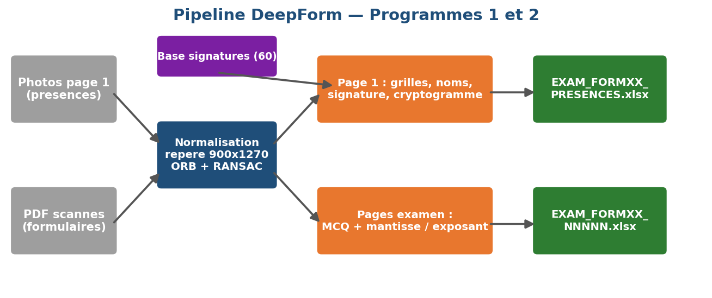

# DeepForm: Automated Exam Form Reading

A computer vision system that reads scanned, semi-structured exam forms end to end: it checks attendance from photos of the first page, verifies each student's signature, decodes student IDs and checkboxes, reads handwritten names and numerical answers, and exports everything to structured Excel files.

Built as a team project for the Computer Vision course (IG.2405) at ISEP Paris, spring 2026.



## Results

Measured cell by cell against the provided ground truth on 130 forms from three different exams.

| Axis | Accuracy |
|---|---|
| Printed text (OCR) | 95.1% |
| Graphical elements (ID grids, checkboxes) | 83.8% |
| Signature verification | 91.5% |
| Handwriting (names, numerical answers) | 57.2% |
| **Overall** | **82.7%** |

Overall accuracy went from 67.2% to 82.7% over the project. The biggest single gain came from the handwritten letter classifier, which went from 59.5% to 86.4% (5-fold cross-validation grouped by writer, so the score reflects handwriting never seen during training) without touching the network architecture, only by fixing data quality and character cropping. The full breakdown is in [`rapport/PROGRESSION.md`](rapport/PROGRESSION.md).

## Approach

The project brief required low-level methods for graphical elements and allowed learned models only for text.

- **Registration.** Every page is aligned to a reference template with ORB keypoints and RANSAC, which also detects upside-down scans.
- **Graphical elements.** Otsu thresholding, mathematical morphology, Hough transform, connected components and normalized cross-correlation to decode student ID grids, group codes, checkboxes and the page cryptogram. No off-the-shelf detector.
- **Signatures.** 1-to-1 verification against the reference of the claimed student, combining NCC, HOG and Hu moments with a decision threshold.
- **Handwriting.** Small CNNs (PyTorch) pretrained on EMNIST, then fine-tuned on characters extracted from the project forms, one for letters and one for digits.
- **Printed text.** EasyOCR, also used to read page numbers and reorder scans whose pages came out of order.

## Repository structure

```
main.py                 Runs both programs on one exam
autoValidPresences.py   Program 1: attendance validation from page 1 photos
autoReadForm.py         Program 2: full reading of the scanned PDFs
utils/                  Registration, grid decoding, checkboxes, signatures, OCR, CNN wrappers
models/                 Trained CNN weights (letters and digits)
training/               Dataset builders and fine-tuning scripts
tools/                  Evaluation against ground truth, calibration helpers
notebooks/              Step-by-step exploration of each stage
rapport/                Report, slides, figures and accuracy log (in French)
docs/                   Original project brief
```

## Usage

```bash
pip install -r requirements.txt
python main.py EXAM_FORM1
```

The trained models are included, so no training is needed. Results are written to `EXAM_FORMXX_RESULTS/`. To run on another dataset, edit the paths at the top of `main.py` (`BDD`, `EXAM_NAME`, `SIGNATURES`). To measure accuracy against ground truth:

```bash
python tools/compare_to_truth.py
```

The exam dataset provided for the course is not included in this repository.

## Limitations

Handwritten exponents and units remain the hardest fields, and some handwriting is ambiguous even to a human reader. A few forms are miscounted when a faint separator line between two questions is missed. The low-level signature descriptor accepts genuine signatures reliably but would not stop a skilled forgery.

## Team

Yann Roquigny-Martin, Oscar Millet, Félix Blanchier, Victor Poussier
